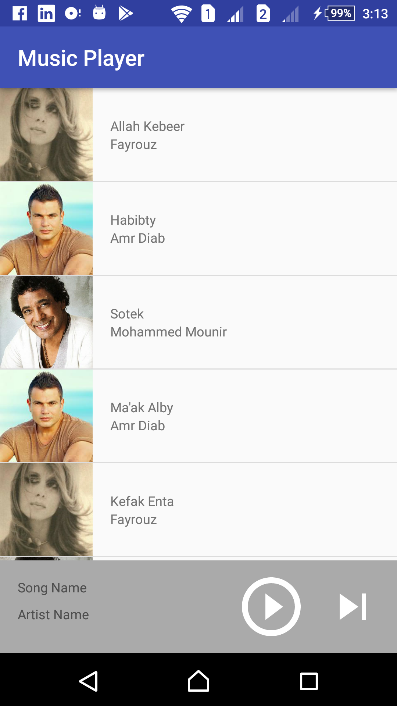
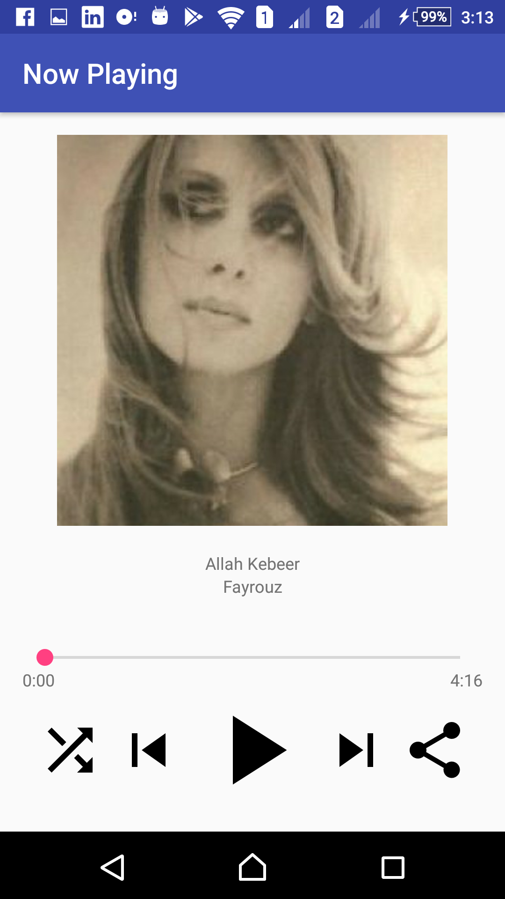

# ABND-Proj4-Music-Player-Structure-App

The fourth project in the Android Basics nanodegree by Google and Udacity: "**(v3) Musical Structure**".
It is the first project in the third course of the nanodegree "Multi-Screen Apps".

***

 

***

## Udacity's Project Overview:

You will be making the structure of a music app using Intents, New Activities, Arraylists, Loops and Custom Classes.

The goal is to design and layout the flow for the structure of a Music Player app. Note that for this project, the app does not actually need to play music.

There are many music player apps, and they employ a wide variety of design choices. It will be your job to decide on the kind of structure that you would like your music app to have and build that structure using intents. Will you build an app to play music from the user’s library of music? Will you build an app to stream random songs from a database? Will you build a musical suggestion engine? Those choices are up to you! 

 [Project Rubric](https://review.udacity.com/#!/projects/341/view)

## App Overview:

It was required to implement an app with just the structure of a music player with no real functionality of playing songs. However, I have added some dummy songs data, with an average user interface to present the app.
I have made a main activity for showing list of the songs, and another for showing the now playing song details, and used some icons and images for artists.

## Android Features:

1. Multiple activities and switching using explicit intents.
2. ListView.
3. ArrayAdapter.
4. Custom Class for ArrayAdapter.
